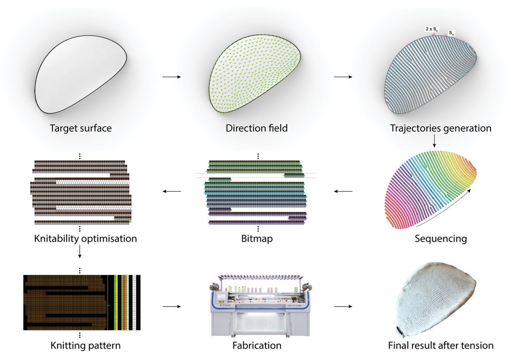

# Fabrication workflow

*Overview of the knitting pattern generation pipeline (Figure 6.5). The directional field is defined on the target
surface, and equally spaced trajectories are extracted from it. The trajectories are sequenced into a continuous
knitting order and written into a bitmap, one pixel per stitch, which is then optimised so that the course endpoints
meet the knittability constraints of the machine. The optimised bitmap is converted to a knitting pattern, knitted
flat, and tensioned into the target surface.*

| Step | Script | Output, in `<folder>/out/` |
|---|---|---|
| Target surface | — | `<folder>/<name>.obj` |
| Direction field | `scripts/fab/1.1_viewfield.py`, `scripts/fab/1.2_edit_field.py` | `<name>_vertex_directional_field.txt` |
| Trajectories generation | `scripts/fab/2_trajectories.py` | `<name>_tri_path.txt`, `<name>_tri_path_recons.txt` |
| Sequencing | `scripts/fab/2_trajectories.py` | `<name>_neighbours.txt`, `<name>_singularities.txt` |
| Bitmap | `scripts/fab/4_pattern.py` | `<name>_bitmap.bmp`, `<name>_pixel_data_dict.pkl` |
| Knittability optimisation | `scripts/fab/4_pattern.py` | `<name>_opt_bitmap.bmp`, `<name>_pixel_data_dict_knittable.pkl` |
| Knitting pattern | <!-- TODO --> | <!-- TODO --> |
| Fabrication | — | — |
| Final result after tension | — | — |

## Target surface

<!-- TODO -->

## Direction field

<!-- TODO -->

## Trajectories generation

<!-- TODO -->

## Sequencing

<!-- TODO -->

## Bitmap

<!-- TODO -->

## Knittability optimisation

<!-- TODO -->

## Knitting pattern

<!-- TODO -->

## Fabrication

<!-- TODO -->
