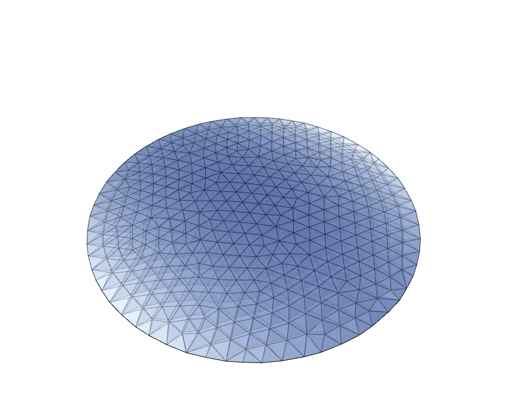

# Validating the simulation: the flat dome

A flat circular membrane, anchored on its boundary and inflated, is the simplest check of the simulation. Its crown
height is compared with Hencky's analytical solution, for an isotropic membrane, and with an independent finite
element program, CalculiX, for the knit.



## The sample

`data/circular_flat/circular_flat.obj`, the circular flat mesh of the fabsim examples: 399 vertices, 735 triangles,
radius a = 0.5985 m, flat in the xy plane with its normals along +z. The 61 boundary vertices are anchored and the
pressure is p = 1000 Pa. The knitting direction, the wale, is read per vertex from
`circular_flat_vertex_directional_field.txt`. `scripts/sim/simulate.py` runs it and shows the result.

## Hencky's solution

For an isotropic membrane of modulus E (N/m, Young's modulus times thickness) clamped on a circle of radius a, Hencky's
solution of the Föppl–von Kármán membrane equations gives the crown height

```
w0 = C(nu) · a · (p a / E)^(1/3),    C(0.3) = 0.662
```

There is no such closed form for the orthotropic knit, so it is checked against CalculiX.

## CalculiX

[CalculiX](http://www.calculix.de) 2.23, with the same mesh as M3D3 membrane elements, geometric nonlinearity (`NLGEOM`,
which with a linear elastic material is St. Venant–Kirchhoff, the material of `knit_sim`) and a follower pressure. The
knit's stiffness matrix

```
C = 1/(1 - nu²) · [[E_w,             nu √(E_w E_c),  0                    ],
                   [nu √(E_w E_c),   E_c,            0                    ],
                   [0,               0,              ½ √(E_w E_c)(1 - nu) ]]
```

is given as orthotropic engineering constants, E1 = E_w, E2 = E_c, nu12 = nu √(E_w / E_c),
G12 = √(E_w E_c) / (2 (1 + nu)), oriented along the wale. A flat membrane has no stiffness against pressure at the
start, so both programs get the same small pre-tension, a stretch of 1.001, in CalculiX as a thermal contraction.

## Results

Crown height in metres, p = 1000 Pa.

| Material (N/m) | Wale | Hencky | CalculiX | knit_sim |
|---|---|---|---|---|
| isotropic, E 10000, nu 0.3 | — | 0.1550 | 0.1538 | 0.1538 |
| E_w 10300, E_c 13400, nu 0.58 | x | — | 0.1245 | 0.1245 |
| E_w 5000, E_c 2500, nu 0.198 | x | — | 0.2268 | 0.2268 |
| E_w 12500, E_c 5000, nu 0.198 | y | — | 0.1684 | 0.1684 |

The same 10300 / 13400 material at 1100 and 1200 Pa: 0.1287 and 0.1327 m, in both programs.

`knit_sim` and CalculiX agree to four digits. Hencky's solution is for a perfectly flexible membrane with small slopes,
and is 0.8 % above both; on a finer disc, `scripts/tests/simulate_disc.py`, `knit_sim` is within 0.1 % of it:

| Disc, radius 0.5 m, E 10000 N/m, nu 0.3 | Triangles | Hencky | knit_sim |
|---|---|---|---|
| edge 0.04 m | 1015 | 0.1219 | 0.1220 (+0.06 %) |
| edge 0.02 m | 3929 | 0.1219 | 0.1219 (+0.00 %) |

## A layer of concrete

A thin layer of concrete is cast on the inflated knit, `added_mass` in `knit_sim`, its density times its thickness per
unit area. Its weight is G = area x density x thickness x g, the area of each triangle on the inflated surface, the
surface the concrete is cast on, a third on each corner, acting straight down. Once cast its mass is fixed: it does not
change as the knit deforms further under it. It is put on after the inflation, in steps of 10, 50 and 100 %, the
pressure held. In CalculiX it is a third step, the same nodal forces, from the area of the inflated surface.
E_w 12500, E_c 5000, nu 0.198, the wale along y, 1000 Pa, the pre-tension of 1.001, concrete of 2400 kg/m3, on an
inflated surface of 1.2227 m2:

| Concrete | kg/m2 | G (N) | CalculiX | knit_sim |
|---|---|---|---|---|
| none | 0 | 0 | 0.1684 | 0.1684 |
| 5 mm | 12 | 143.8 | 0.1609 | 0.1609 |
| 10 mm | 24 | 287.6 | 0.1526 | 0.1526 |
| 20 mm | 48 | 575.2 | 0.1324 | 0.1324 |

`scripts/sim/simulate_inf_concrete.py` is the example: the two-pattern field and the stretch factors 1.1 and 1.1, with
10 mm of concrete, 268 N, lowers the crown from 0.0741 to 0.0584 m; the pressure, 1000 Pa over a plan of 1.125 m2,
about 1125 N, still holds it up. `scripts/sim/simulate_concrete.py` has the concrete only, without the pressure: cast on the
flat knit, it stretches it down, a hanging shape.

## A point load

A force on a vertex, fixed in size and direction, `point_loads` in `knit_sim`, put on after the inflation, in steps of
10, 50 and 100 %, the pressure held, together with any added weight. In CalculiX it is a third step, the same force on
the same node. E_w 12500, E_c 5000, nu 0.198, the wale along y, 1000 Pa, the pre-tension of 1.001, a load straight down
on the vertex nearest the centre; the height there, in metres:

| Point load | CalculiX | knit_sim |
|---|---|---|
| 50 N | 0.1275 | 0.1275 |
| 100 N | 0.0943 | 0.0943 |
| 200 N | 0.0357 | 0.0357 |

A membrane has no bending stiffness, so the dent under a load on a single vertex depends on the size of the mesh: the
finer the mesh, the deeper and sharper. `scripts/sim/simulate_point_load.py` is the example, without pressure: 100 N down
at the centre of the flat knit of the two-pattern field, stretched 1.1 and 1.1, pulls it down to -0.0513 m there. Its
`load_radius` shares the load among the vertices within it, the size of what pushes on the knit. The viewer draws the
load as a red line, on the flat and on the simulated knit.

## The pressure work

The work of the pressure on a triangle is p times the volume of the tetrahedron it makes with the origin,
x0 · (x1 × x2) / 6 = (x0 + x1 + x2) · n / 18, with n = (x0 − x2) × (x1 − x2).
`src/cpp_sim/patches/fabsim_pressure_volume.patch` sets this in the energy, the gradient and the Hessian of the
orthotropic and isotropic StVK elements of fabsim, and is applied when `knit_sim` is built.

## The current example

`scripts/sim/simulate.py` with E_w 12500, E_c 5000, nu 0.198 and the stretch factors 1.1 and 1.1, at 1000 Pa, with either
field of the mesh, chosen by `field_name`:

| Field | Crown height (m) | von Mises stress (N/m) |
|---|---|---|
| `circular_flat`, the wale along y (the image above) | 0.0728 | 1344 to 1493 |
| `circular_flat_2part`, the two-pattern disc | 0.0741 | 1286 to 1532 |

The two-pattern field is the per-face field `FDM/data/2part/circle_face_directional_field.txt` of fabsim-example-project,
averaged onto the vertices; the face directions `knit_sim` makes of it are within 0.5 degrees of the original on
average, 3.6 at most. The pre-strain is a rest shape smaller than the mesh, which a thermal contraction in CalculiX
only approximates at large strains, so these are not in the comparison.

## Run it

```
python scripts/sim/simulate.py               # the example, and the viewer
python scripts/sim/simulate_inf_concrete.py  # the same, then a layer of concrete on the inflated knit
python scripts/sim/simulate_concrete.py      # a layer of concrete only, without the pressure
python scripts/sim/simulate_point_load.py    # a point load on the flat knit, without the pressure
python scripts/tests/simulate_disc.py    # the discs against Hencky, fails if more than 2 % off
```
